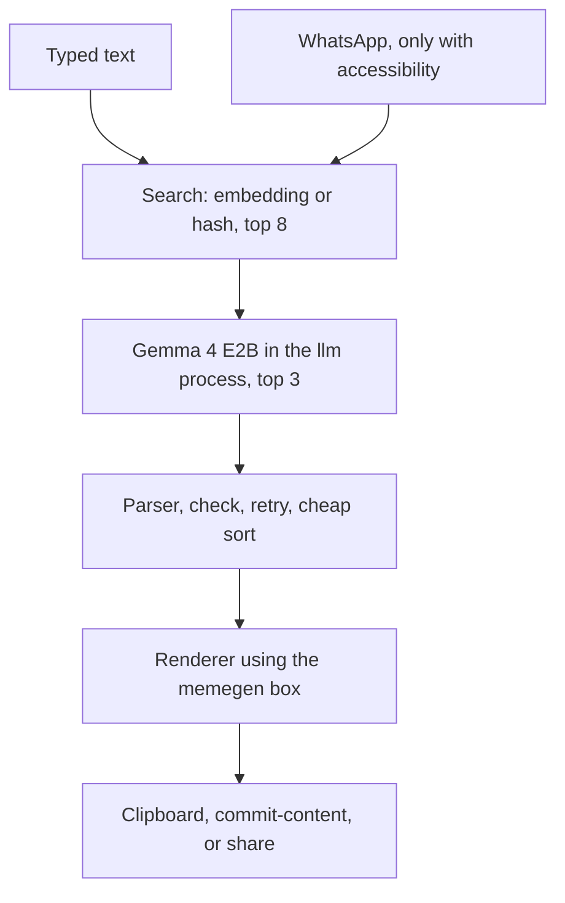

# MemEm

MemEm is a sideload Android keyboard. Typed text becomes three meme suggestions. A tap on a card puts the PNG into the input field. MemEm never sends a message.

Package `app.memem`, minSdk 29, targetSdk 36, `arm64-v8a` only. Version 0.2.6.

The on-device UI is German. Labels such as `wörtlich` and `KI` are quoted below as they appear in the app.

<p>

</p>

## Demo

A phone recording of the setup wizard and the MemEm keyboard with meme cards. The picture is a short preview. The full video is the MP4.

<p>
<a href="docs/demo/memem-demo.mp4"></a>
</p>

[memem-demo.mp4](docs/demo/memem-demo.mp4)

## Features

* A Gboard-style keyboard with three meme previews. The default layout is English QWERTY, space bar `EN`. QWERTZ is optional, and the space bar then reads `DE`.
* A local rewrite with Gemma 4 E2B, always on the CPU. While the model runs, the cards show the literal wording (`wörtlich`). A usable rewrite replaces it (`KI`).
* Captions follow the language of the typed message. Wrong language needs two clear foreign words. Relevance is a margin against unrelated sentences, with a floor of -0.03, plus a check that the caption is closer to its own message than to other everyday messages. A line with three content words from the message in a row is a copy. Cards that pass are shown immediately. If fewer than three cards pass, MemEm tries once more in the background and appends those cards. A skipped or cut-off template is filled from a later search hit. Gemma E2B is the default. Qualität (E4B) is an optional slower model. German and English example captions are both curated.
* Vector search over 6,491 points (EmbeddingGemma, or a hash index shipped in the repo). The best three templates go to Gemma in one call.
* Chat context through the accessibility service, WhatsApp only. The last visible messages go into search and the prompt. The typed text stays the message.
* Insert via the clipboard (`content://` from the FileProvider) and, when the field accepts images, via commit-content. If the keyboard does not report success, `ACTION_PASTE` runs on the WhatsApp field. Share is last. The send button is never pressed.
* A short press on the globe switches to the previous keyboard. A long press opens the keyboard picker. A long press on space switches as well, without the dialog. Enter inserts a newline.

Settings and the wizard keep the ReadEm look: cream cards, a black edge, a hard shadow, Anton. The keyboard itself is flat.

## Credits

MemEm builds on this work. Licenses are in [THIRD_PARTY_NOTICES.md](THIRD_PARTY_NOTICES.md).

* [memegen](https://github.com/jacebrowning/memegen) by Jace Browning: templates and the text-field config that the catalog and the renderer build on. The code is MIT. Template images may be third-party rights.
* [ImgFlip575K](https://github.com/schesa/ImgFlip575K_Dataset): captions in the search index.
* [LoC-meme-generator](https://huggingface.co/datasets/pszemraj/LoC-meme-generator): more captions, ODC-BY.
* [Gemma 4](https://ai.google.dev/gemma/docs/core) and [EmbeddingGemma](https://ai.google.dev/gemma/docs/embeddinggemma) by Google, under the [Gemma Terms of Use](https://ai.google.dev/gemma/terms). The weights are not in this repo.
* [LiteRT-LM](https://github.com/google-ai-edge/LiteRT-LM): on-device and `rewrite-cli` inference.
* [ChatLens](https://github.com/slickdajackson/ChatLense): the earlier codebase for accessibility, paste, and the floating dot. What was adopted is in [docs/chatlens.md](docs/chatlens.md).

## Architecture



Gemma and the embedding run in the `:llm` process through LiteRT-LM, always `Backend.CPU`. The keyboard talks to that process over Binder. A native abort ends only `:llm`. The keyboard starts it again.

The caption language matches the typed message. Recent chat, then the keyboard layout or the phone language, fills in when the typed line is unclear. A line is the wrong language only when it has at least two unambiguous foreign words. Each template may keep its own catchphrase, including its display name. Another template's name is rejected. Relevance stays a margin against unrelated reference sentences. A score under -0.03 is off topic, and the caption must also be closer to the typed message than to three other messages. Those other messages are a pool of everyday German and English lines, not the sentences used to grade the app. A line is a copy when it has at least four words and covers at least 80 percent of the message, when three content words from the message sit in a row, or when the whole caption's cosine is above 0.97. Short setups such as "Prüfung bestanden" stay. A statement loses a stray question mark. An obvious typo drops the card, including a wrong article such as "Die Zug". A one-line caption on a template with several fields is dropped. A phrase is not split across fields. Identical captions are kept on one card only. Leftover JSON braces and quotes are stripped from lines. Cards that pass are shown at once. That moment is the measured latency. If fewer than three cards pass, those templates are tried once more in the background, at temperature 0.55, with a hint to rephrase instead of repeating the message. A skipped or cut-off template is replaced by the next search hit. The new cards are appended. Cards that still fail are dropped. Qualität (E4B) is off unless the user turns it on. Every rejected card is logged with its reason.

## Screenshots

Captured with Robolectric from the running UI (`ScreenRenderTest`). The three memes use the same renderer as the keyboard.

| | |
| --- | --- |
| Keyboard with three suggestions | Setup wizard, step 1 |
|  |  |
| Main screen | Settings |
|  |  |

Example memes, rendered from the shipped templates:

<p>


</p>

## Install

1. Sideload the debug APK and confirm the system security check.
2. On first launch the wizard covers download, enabling the keyboard, choosing the keyboard, optional accessibility, and a try field. Every page has a forward button. An open step shows a hint and still lets you continue. Close or finish opens the main screen. After that the wizard does not start on its own. Unfinished setup stays as the hint "Einrichtung unvollständig", with a button to continue.
3. On-screen keyboards: turn MemEm on, then choose it as the active keyboard.
4. In WhatsApp, type with MemEm and press **Meme**. Three previews always appear. A suggestion clears the text and inserts the PNG.

### Xiaomi, HyperOS

If enabling accessibility shows the restricted-settings warning: close the dialog, then Settings, Apps, MemEm, three-dot menu, **Eingeschränkte Einstellungen zulassen**, confirm with fingerprint or PIN. Then go back to accessibility and turn the switch on.

Without autostart and without "Keine Einschränkungen" for the battery, HyperOS stops the download, the floating dot, and the `:llm` process. Paths are in [docs/hyperos.md](docs/hyperos.md). They have not been rechecked on a Xiaomi 15 Ultra in this build.

### Models

A foreground service downloads on first launch:

* EmbeddingGemma 2 Text 270M, about 157 MB
* Gemma 4 E2B, about 2.6 GB, always CPU

SHA-256 is checked. A stopped download stays as a partial file and resumes. After success the download notification goes away.

## Build

JDK 21, the Android SDK, and `local.properties` with `sdk.dir` if needed.

```bash
python3 tools/build_assets.py
python3 tools/build_index.py /path/embeddinggemma-2-text-270m.litertlm
./gradlew :engine:test :app:testDebugUnitTest :app:assembleDebug
```

`build_assets.py` reads the memegen config and writes the catalog and images. `build_index.py` re-embeds the points (prefix `task: search result | text: `, query `task: search query | text: `). Until the embedding model is present, the app searches with `vectors-hash.f16`.

The prototype is under `reference/memechat/`.

## rewrite-cli

The same rewrite as the app, on the JVM:

```bash
./gradlew :tools:rewrite-cli:run --args="--gemma /path/gemma-4-E2B-it.litertlm --embed /path/embeddinggemma-2-text-270m.litertlm --sentences sentences.txt"
```

One sentence per line. Output is Markdown and JSON: template, lines, source `KI` or `wörtlich`, reason, raw reply, latency.

`com.google.ai.edge.litertlm:litertlm-jvm:0.18.0` contains `liblitertlm_jni.so` for `linux-x86_64`. The loader takes it from the JAR at `com/google/ai/edge/litertlm/jni/linux-x86_64/liblitertlm_jni.so`. JDK 21 and glibc are enough. No extra package is required. If loading fails, that `.so` is missing for the architecture, or `LD_LIBRARY_PATH` points at a different `liblitertlm_jni.so`.

If the embedding model does not load, the tool searches with the hash index. Prompt, parser, check, and the one retry per template match the app. The first embedding call is discarded.

## Privacy

Everything stays on the device. There is no account and no MemEm server. Models, embeddings, the search index, and the log of recent requests (`files/debug/pipeline.jsonl`) do not leave the phone unless the user shares the log. The accessibility service sees only `com.whatsapp` and reads the open chat while it is on. It does not tap send.

## License

Own code: [MIT](LICENSE). Third-party pieces, including template images and the Gemma terms: [THIRD_PARTY_NOTICES.md](THIRD_PARTY_NOTICES.md).
