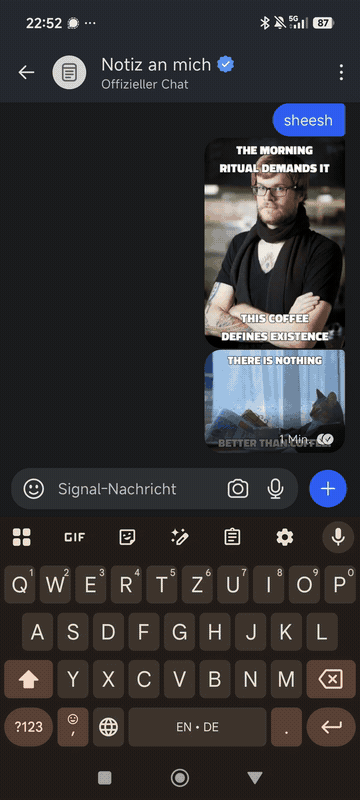
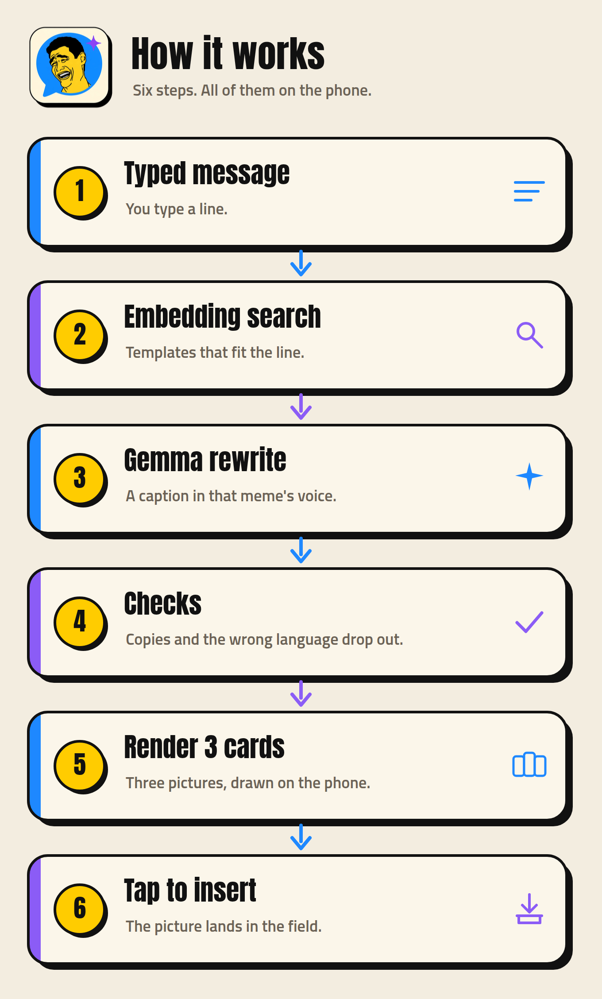

<p align="center">

</p>

# MemEm

Type a line. Get three memes. Drop one into the chat.

## At a glance

* Chat in memes. The picture lands in the field, and MemEm never presses send.
* Three suggestions show up as you type.
* Captions are rewritten in the meme's own style, not copied from your sentence.
* The joke follows your language. German in, German out. English in, English out.
* Fully on the phone: private, no account, no MemEm server.
* Works in WhatsApp, and in any app that can use this keyboard.

## Demo

A short phone recording: the setup wizard, then the keyboard with meme cards.

<p>
<a href="docs/demo/memem-demo.mp4"></a>
</p>

[Watch the full video](docs/demo/memem-demo.mp4)

## Download

[Download](https://github.com/slickdajackson/MemEm/releases/tag/v0.2.6) MemEm 0.2.6. The file is a debug sideload APK, `arm64-v8a` only, versionCode 17.

Direct file: [MemEm-debug-0.2.6.apk](https://github.com/slickdajackson/MemEm/releases/download/v0.2.6/MemEm-debug-0.2.6.apk)

SHA-256:

```
9b8ca28f873b91b8cedca9cfa043c606e6ea64f36021ad1ff7a27c57a85fbc5a
```

## How it works

1. You type a message.
2. An embedding search picks meme templates that fit.
3. Gemma rewrites a caption for each one.
4. Checks throw out copies, the wrong language, and lines that miss the point.
5. The cards render on the phone.
6. A tap inserts the PNG. Share is the last resort. Send is never pressed.

<p align="center">
<picture>
<source srcset="docs/images/how-it-works.svg" type="image/svg+xml" />

</picture>
</p>

Gemma 4 E2B and EmbeddingGemma run on the CPU, in a separate process. The keyboard talks to that process on the device. While the model is still writing, the cards show your words marked `wörtlich`. A caption that passes is marked `KI`. If fewer than three cards pass, MemEm tries once more in the background and adds those cards when they are ready.

The on-screen UI is German. The default keyboard is English QWERTY (space bar `EN`). QWERTZ is optional (space bar `DE`).

## Screenshots

| | |
| --- | --- |
| Keyboard with three suggestions | Setup wizard, step 1 |
|  |  |
| Main screen | Settings |
|  |  |

<p>


</p>

## Setup

1. [Download](https://github.com/slickdajackson/MemEm/releases/tag/v0.2.6) the APK and sideload it. Confirm the system security check.
2. The wizard opens once: models, turn the keyboard on, choose it, optional WhatsApp help, then a try field. Every page has a forward button. You can skip a step and come back later.
3. On first launch MemEm downloads two models and checks SHA-256: EmbeddingGemma (about 157 MB) and Gemma 4 E2B (about 2.6 GB). A stopped download keeps the partial file and resumes. The notification goes away when the files are ready.
4. In any app, switch to MemEm and type. Press **Meme**. Three cards appear. Tap one to insert the picture.
5. A short press on the globe goes back to the previous keyboard. A long press opens the keyboard list. A long press on space switches too. Enter inserts a newline.

WhatsApp can also share the open chat with the search, if you turn on the accessibility service. That service only looks at WhatsApp. On some Xiaomi phones the system asks for an extra switch before accessibility will start. Notes are in [docs/hyperos.md](docs/hyperos.md).

## Build

JDK 21, the Android SDK, and `local.properties` with `sdk.dir` if the SDK is not in the usual place.

```bash
python3 tools/build_assets.py
python3 tools/build_index.py /path/embeddinggemma-2-text-270m.litertlm
./gradlew :engine:test :app:testDebugUnitTest :app:assembleDebug
```

`build_assets.py` reads a memegen checkout (`MEMEM_MEMEGEN`, default `vendor/memegen`) and writes the catalog and images. `build_index.py` takes the path to the EmbeddingGemma file and rebuilds the search vectors. Until that file is present, search uses the hash index shipped in the repo. The model weights themselves are not in the repo. Package `app.memem`, minSdk 29, targetSdk 36.

## rewrite-cli

Same rewrite as the app, on the JVM:

```bash
./gradlew :tools:rewrite-cli:run --args="--gemma /path/gemma-4-E2B-it.litertlm --embed /path/embeddinggemma-2-text-270m.litertlm --sentences sentences.txt"
```

One sentence per line. The report is Markdown and JSON: template, lines, source (`KI` or `wörtlich`), reason, raw reply, and latency to the first cards. `litertlm-jvm:0.18.0` brings `liblitertlm_jni.so` for `linux-x86_64`. JDK 21 is enough. If the embedding model does not load, search falls back to the hash index.

## Privacy

Text, models, embeddings, and the search index stay on the device. There is no account and no MemEm server. A local debug log is written under the app files and is not uploaded. The accessibility service, if you turn it on, sees only WhatsApp and does not tap send.

## Credits

MemEm builds on this work. Details and licenses are in [THIRD_PARTY_NOTICES.md](THIRD_PARTY_NOTICES.md).

* [memegen](https://github.com/jacebrowning/memegen) by Jace Browning: templates and text boxes. Code is MIT. Template images may belong to others.
* [ImgFlip575K](https://github.com/schesa/ImgFlip575K_Dataset): captions in the search index.
* [LoC-meme-generator](https://huggingface.co/datasets/pszemraj/LoC-meme-generator): more captions, ODC-BY.
* [Gemma 4](https://ai.google.dev/gemma/docs/core) and [EmbeddingGemma](https://ai.google.dev/gemma/docs/embeddinggemma) by Google, under the [Gemma Terms of Use](https://ai.google.dev/gemma/terms). The weights are not in this repo.
* [LiteRT-LM](https://github.com/google-ai-edge/LiteRT-LM): on-device inference, and the JVM library behind `rewrite-cli`.
* [ChatLense](https://github.com/slickdajackson/ChatLense): accessibility, paste, and the floating dot. What was adopted is in [docs/chatlens.md](docs/chatlens.md).

## License

Own code is [MIT](LICENSE). Third-party pieces, including template images and the Gemma terms, are in [THIRD_PARTY_NOTICES.md](THIRD_PARTY_NOTICES.md).
