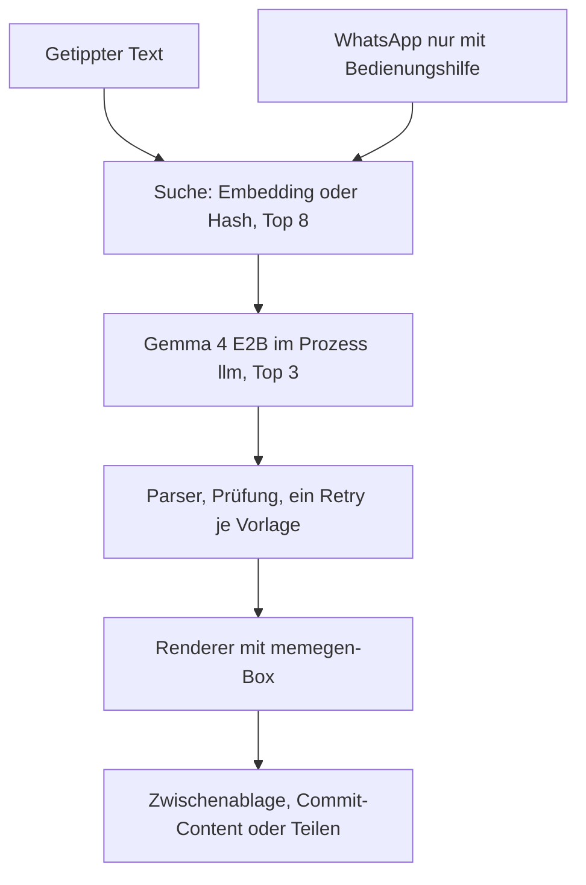
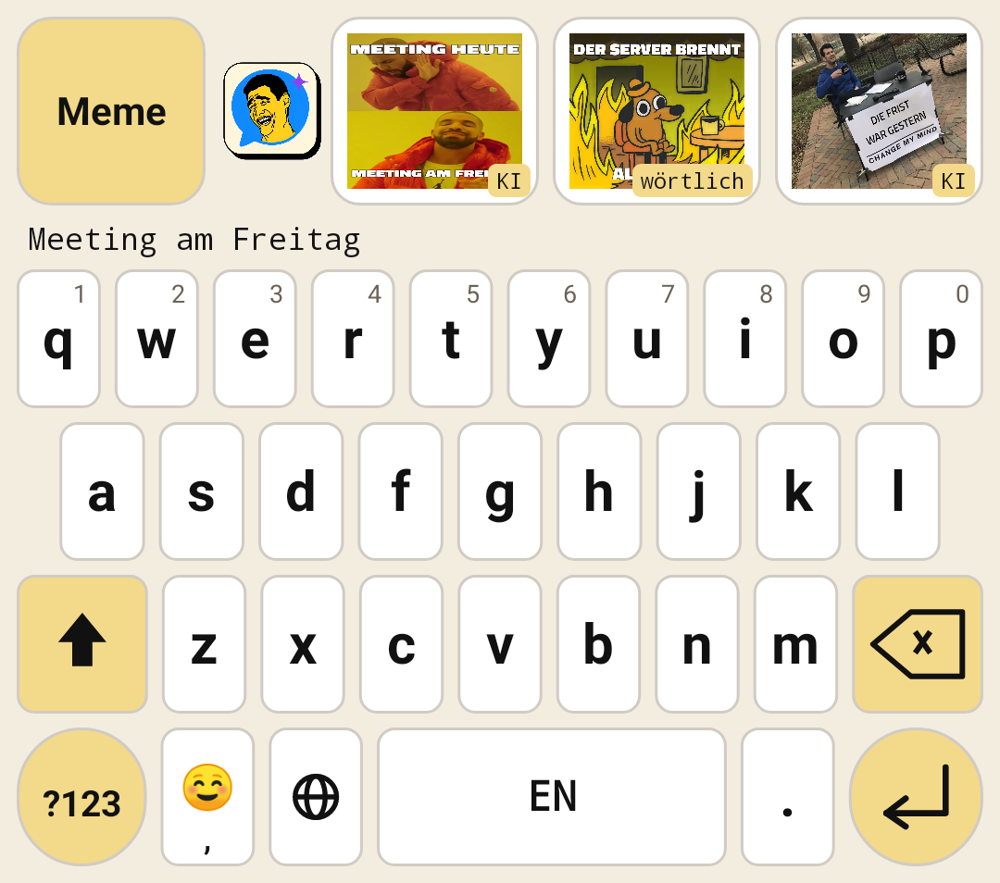
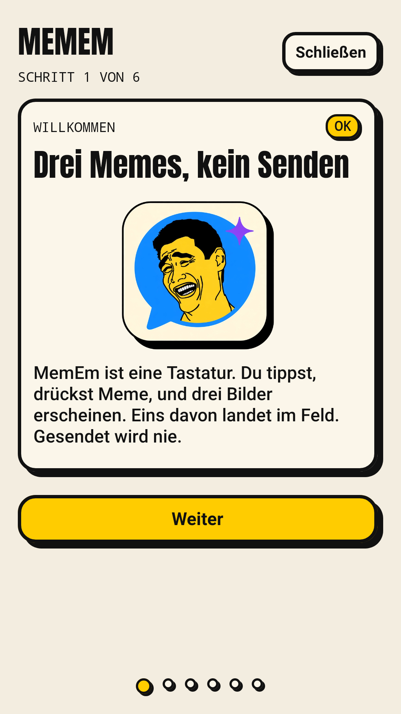
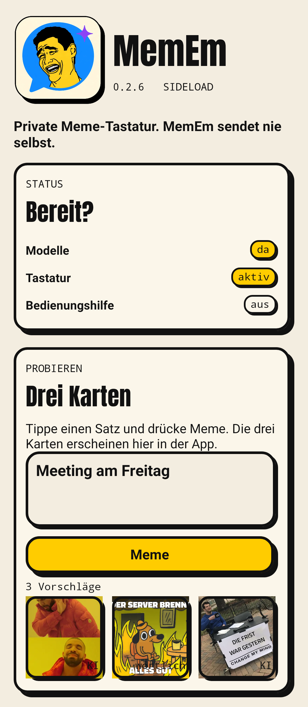
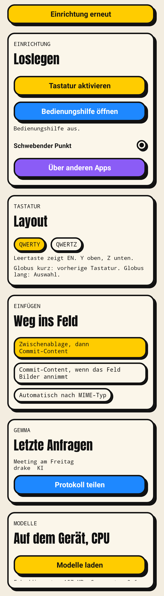
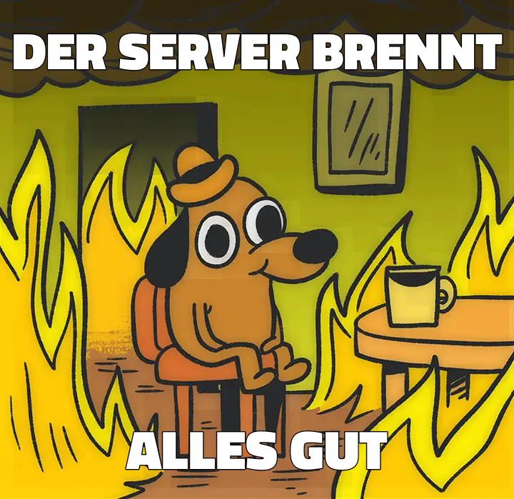

# MemEm

MemEm ist eine Android-Tastatur zum Sideload. Aus dem getippten Text werden drei Memes vorgeschlagen. Ein Tippen auf eine Karte legt das PNG ins Eingabefeld. MemEm sendet nie selbst.

Paket `app.memem`, minSdk 29, targetSdk 36, nur `arm64-v8a`. Version 0.1.8.

<p>

</p>

## Funktionen

* Tastatur im Gboard-Zuschnitt mit drei Meme-Vorschlägen. Standard ist englisches QWERTY, Leertaste `EN`. QWERTZ ist zuschaltbar, Leertaste dann `DE`.
* Lokale Umschrift mit Gemma 4 E2B, immer auf der CPU. Solange das Modell rechnet, zeigen die Karten die wörtliche Fassung (`wörtlich`). Eine brauchbare Umschrift ersetzt sie (`KI`).
* Vektorsuche über 6.491 Punkte (EmbeddingGemma, sonst ein Hash-Index im Repo). Die besten drei Vorlagen gehen in einem Aufruf an Gemma.
* Chat-Kontext über die Bedienungshilfe, nur WhatsApp. Die letzten sichtbaren Nachrichten gehen in Suche und Prompt. Der getippte Text bleibt die Nachricht.
* Einfügen über die Zwischenablage (`content://` vom FileProvider) und, wenn das Feld Bilder annimmt, über Commit-Content. Meldet die Tastatur keinen Erfolg, folgt `ACTION_PASTE` im WhatsApp-Feld. Zuletzt bleibt Teilen. Der Senden-Knopf wird nicht gedrückt.
* Globus kurz wechselt zur vorherigen Tastatur. Globus lang öffnet die Tastaturauswahl. Langer Druck auf die Leertaste wechselt ebenfalls, ohne den Dialog. Enter fügt einen Zeilenumbruch ein.

Die App bleibt im ReadEm-Stil: cremefarbene Karten, schwarzer Rand, harter Schatten, Anton. Die Tastatur selbst ist flach.

## Quellen

MemEm steht auf diesen Arbeiten. Die Lizenzen stehen in [THIRD_PARTY_NOTICES.md](THIRD_PARTY_NOTICES.md).

* [memegen](https://github.com/jacebrowning/memegen) von Jace Browning: Vorlagen und die Textfeld-Konfiguration, auf denen Ablage und Renderer aufbauen. Der Code ist MIT. Die Vorlagenbilder können Rechte Dritter sein.
* [ImgFlip575K](https://github.com/schesa/ImgFlip575K_Dataset): Bildunterschriften im Suchindex.
* [LoC-meme-generator](https://huggingface.co/datasets/pszemraj/LoC-meme-generator): weitere Bildunterschriften, ODC-BY.
* [Gemma 4](https://ai.google.dev/gemma/docs/core) und [EmbeddingGemma](https://ai.google.dev/gemma/docs/embeddinggemma) von Google, unter den [Gemma Terms of Use](https://ai.google.dev/gemma/terms). Die Gewichte liegen nicht in diesem Repo.
* [LiteRT-LM](https://github.com/google-ai-edge/LiteRT-LM): Inferenz auf dem Gerät und in `rewrite-cli`.
* [ChatLens](https://github.com/slickdajackson/ChatLense): eigene frühere Basis für Bedienungshilfe, Einfügen und den schwebenden Punkt. Was übernommen wurde, steht in [docs/chatlens-uebernahme.md](docs/chatlens-uebernahme.md).

## Architektur



Gemma und das Embedding laufen im Prozess `:llm` über LiteRT-LM, immer `Backend.CPU`. Die Tastatur spricht den Prozess per Binder an. Ein nativer Abbruch beendet nur `:llm`. Die Tastatur startet ihn neu.

Die Prüfung verwirft leere, doppelte, abgebrochene und beispielgleiche Zeilen sowie eine fremde Sprache, außer bei festen Phrasen wie `It's a trap!`. Fällt eine Karte durch, wird nur diese Vorlage einmal neu versucht. Sonst bleibt die gekennzeichnete wörtliche Fassung.

## Bilder

Aufgenommen mit Robolectric aus der laufenden Oberfläche (`ScreenRenderTest`), die drei Memes mit demselben Renderer wie die Tastatur.

| | |
| --- | --- |
| Tastatur mit drei Vorschlägen | Einrichtung, Schritt 1 |
|  |  |
| Hauptansicht | Einstellungen |
|  |  |

Beispiel-Memes, gerendert aus den mitgelieferten Vorlagen:

<p>



</p>

## Installation

1. Debug-APK sideloaden und die Sicherheitsprüfung des Systems bestätigen.
2. Beim ersten Start führt der Assistent durch Download, Tastatur einschalten, Tastatur wählen, optionale Bedienungshilfe, optionales HyperOS und ein Probierfeld. Schließen oder Fertig öffnet die Hauptansicht. Danach startet der Assistent nicht von selbst. Unfertige Pflichtpunkte bleiben als Hinweis „Einrichtung unvollständig“, mit Knopf zum Fortsetzen.
3. Bildschirmtastaturen: MemEm einschalten, danach als aktive Tastatur wählen.
4. In WhatsApp mit MemEm tippen und **Meme** drücken. Es erscheinen immer drei Vorschaubilder. Ein Vorschlag löscht den Text und fügt das PNG ein.

### Xiaomi, HyperOS

Kommt beim Einschalten der Bedienungshilfe der Hinweis auf eingeschränkte Einstellungen: Dialog schließen, dann Einstellungen, Apps, MemEm, Drei-Punkte-Menü, **Eingeschränkte Einstellungen zulassen**, mit Fingerabdruck oder PIN bestätigen. Danach zurück zur Bedienungshilfe und den Schalter einschalten.

Ohne Autostart und ohne „Keine Einschränkungen“ beim Akku beendet HyperOS den Download, den schwebenden Punkt und den Prozess `:llm`. Die Pfade stehen in [docs/hyperos.md](docs/hyperos.md). Sie sind am Xiaomi 15 Ultra in diesem Stand nicht erneut geprüft.

### Modelle

Ein Vordergrunddienst lädt beim ersten Start:

* EmbeddingGemma 2 Text 270M, etwa 157 MB
* Gemma 4 E2B, etwa 2,6 GB, immer CPU

SHA-256 wird geprüft. Ein abgebrochener Download bleibt als Teildatei und setzt fort. Nach Erfolg verschwindet die Download-Benachrichtigung.

## Bauen

JDK 21, Android SDK, `local.properties` mit `sdk.dir` falls nötig.

```bash
python3 tools/build_assets.py
python3 tools/build_index.py /pfad/embeddinggemma-2-text-270m.litertlm
./gradlew :engine:test :app:testDebugUnitTest :app:assembleDebug
```

`build_assets.py` liest die memegen-Konfiguration und schreibt Katalog und Bilder. `build_index.py` bettet die Punkte neu ein (Präfix `task: search result | text: `, Anfrage `task: search query | text: `). Solange das Einbettungsmodell fehlt, sucht die App mit `vectors-hash.f16`.

Der Prototyp liegt unter `reference/memechat/`.

## rewrite-cli

Dieselbe Umschrift wie in der App, auf der JVM:

```bash
./gradlew :tools:rewrite-cli:run --args="--gemma /pfad/gemma-4-E2B-it.litertlm --embed /pfad/embeddinggemma-2-text-270m.litertlm --sentences saetze.txt"
```

Eine Zeile pro Satz. Die Ausgabe ist Markdown und JSON: Vorlage, Zeilen, Quelle `KI` oder `wörtlich`, Grund, Roh-Antwort, Latenz.

`com.google.ai.edge.litertlm:litertlm-jvm:0.18.0` enthält `liblitertlm_jni.so` für `linux-x86_64`. Der Lader zieht sie aus dem JAR unter `com/google/ai/edge/litertlm/jni/linux-x86_64/liblitertlm_jni.so`. Nötig sind JDK 21 und glibc. Ein weiteres Paket ist nicht vorgesehen. Scheitert das Laden, fehlt diese `.so` für die Architektur, oder `LD_LIBRARY_PATH` zeigt auf eine andere `liblitertlm_jni.so`.

Klappt das Embedding-Modell nicht, sucht das Werkzeug mit dem Hash-Index. Prompt, Parser, Prüfung und der eine Retry je Vorlage sind dieselben wie in der App. Der erste Embedding-Aufruf wird verworfen.

## Datenschutz

Alles bleibt auf dem Gerät. Es gibt kein Konto und keinen eigenen Server. Modelle, Embeddings, der Suchindex und das Protokoll der letzten Anfragen (`files/debug/pipeline.jsonl`) verlassen das Telefon nicht, außer der Nutzer teilt das Protokoll selbst. Die Bedienungshilfe sieht nur `com.whatsapp` und liest den offenen Chat, solange sie an ist. Sie tippt nicht auf Senden.

## Lizenz

Eigener Code: [MIT](LICENSE). Bestandteile Dritter, einschließlich der Vorlagenbilder und der Gemma-Bedingungen: [THIRD_PARTY_NOTICES.md](THIRD_PARTY_NOTICES.md).
